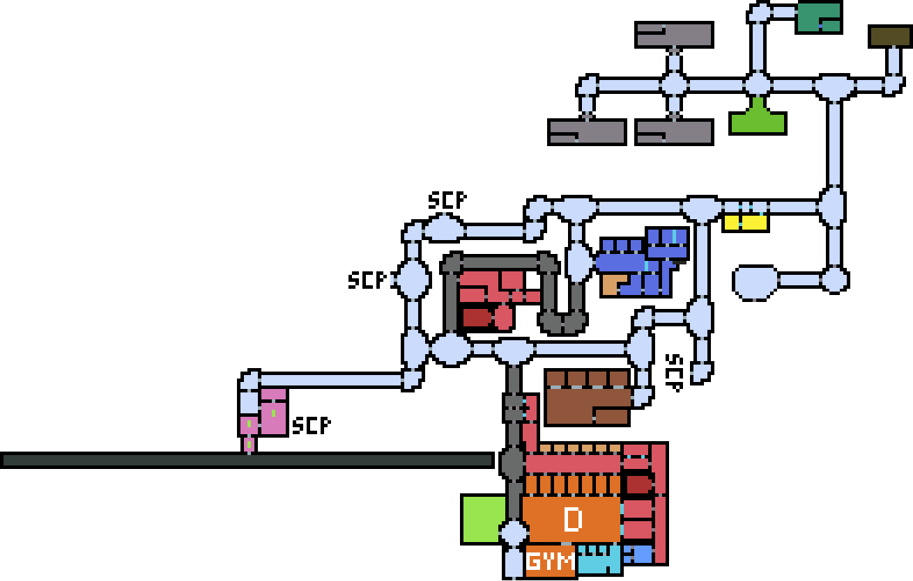
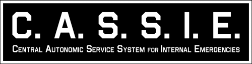

{{#template ../../templates/wip.md}}

# Игровой сервер: SCP. Основной концепт.

# Станция

## Цели 

--

## Глобальные оповещения C.A.S.S.I.E

C.A.S.S.I.E. (англ. Central Autonomic Service System for Internal Emergencies — Центральная автономная сервисная система для внутрикомплексных оповещений) — является внутриигровой системой оповещений по всему комплексу. Существует, чтобы оповещать персонал о произошедших в пределах комплекса событиях.

Звуки: [https://ru.scpslgame.com/index.php?title=C.A.S.S.I.E](https://ru.scpslgame.com/index.php?title=C.A.S.S.I.E.)

Всё для TTS: [https://drive.google.com/drive/folders/1ELV_vYg22alSnq7hfr0lyWulkRFkD5jt](https://drive.google.com/drive/folders/1ELV_vYg22alSnq7hfr0lyWulkRFkD5jt)

### Прибытие МОГ
Юниты Мобильной Оперативной Группы, Эпсилон-11, обозначенный Девятихвостая лиса, вошли в пределы комплекса. Всему оставшемуся персоналу советуется следовать стандартному протоколу эвакуации, до тех пор, пока члены Мобильной Оперативной Группы не доберутся до места назначения.
Ожидание восстановления условий: 3 SCP субъектов.

Существенная угроза безопасности остаётся в пределах комплекса, проявите осторожность.

### Гибель SCP объектов

1. SCP-173 успешно сдержан. Группа сдерживания: Девятихвостая лиса.

2. SCP-939 успешно уничтожен персоналом класса-д.

3. SCP-106 успешно уничтожен Повстанцем Хаоса.

4. SCP-173 успешно уничтожен научным персоналом.

5. SCP-049 успешно уничтожен автоматической системой защиты.

### Подрыв Альфа-боеголовки
1. Активирована детонация Альфа боеголовок, до детонации подземной часть комплекса - 120 секунд.

2. Детонация отменена. Восстановление систем

3. Детонация возобновлена. До взрыва {оставшееся время}», например: «Детонация возобновлена. До взрыва 40 секунд.

## Уровни

### Уровень 1: Поверхность
Местность, куда прилетают оперативники МОГ, повстанцы хаоса, сбегают класс D.

### Уровень 2: Офисы
Кабинеты научных сотрудников.
Место с секретными документами.

### Уровень 3: Light зона
Зона с местом проживания класса D, брига службы безопасности.

### Уровень 4: Hard зона
Зона содержания опасных объектов SCP.

## Уровни доступа

### Уровень 0 (Для общего пользования)

Уровень допуска 0 выдаётся сотрудникам, не представляющим особой ценности, которым не требуется доступ к информации об аномальных артефактах или существах, содержащихся Фондом. Как правило, уровень допуска 0 имеется у сотрудников, занимающих должности в канцелярии и отделе снабжения учреждений, непосредственно не связанных с содержанием объектов, а также у обслуживающего персонала таких учреждений.

### Уровень 1 (Для служебного пользования)

Уровень допуска 1 выдаётся сотрудникам, работающим в непосредственной близости от аномальных объектов или существ, но не обладающих к ним прямым, непрямым или информационным доступом, а также сотрудникам, имеющим дело с засекреченной информацией. Как правило, уровень допуска 1 имеется у сотрудников, занимающих должности в канцелярии и отделе снабжения учреждений, непосредственно занимающихся содержанием объектов, а также у обслуживающего персонала таких учреждений.

### Уровень 2 (Для ограниченного пользования)

Уровень допуска 2 выдаётся сотрудникам службы безопасности и научным сотрудникам, которым необходим прямой доступ к базовой информации касательно аномальных объектов или существ, находящихся на содержании. Большинство научных сотрудников, полевых агентов и специалистов по содержанию обладают уровнем допуска 2.

### Уровень 3 (Секретно)

Уровень допуска 3 выдаётся старшим сотрудникам службы безопасности и научным сотрудникам, которым необходим доступ к подробной информации касательно аномальных объектов или существ, находящихся на содержании, включая их происхождение, обстоятельства изъятия и долгосрочные планы на них. Большинство старших научных сотрудников, руководителей проектов, офицеров службы безопасности, членов групп реагирования и оперативников МОГ обладают уровнем допуска 3.

### Уровень 4 (Совершенно секретно)

Уровень допуска 4 выдаётся старшему управленческому персоналу, которому необходим доступ ко всей информации отдельного учреждения и/или региона, а также к долгосрочным планам касательно операций и научных проектов Фонда. Как правило, 4 уровнем допуска обладают только руководители Зон, руководители служб безопасности учреждений и командующие МОГ.

### Уровень 5 (Таумиэль)

Уровень допуска 5 выдаётся сотрудникам высшего управленческого звена Фонда и гарантирует практически полный доступ ко всей стратегической и секретной информации. Как правило, уровнем допуска 5 обладают только члены Совета O5.

## Роли

`название (уровень доступа)`

### Класс A
- [ ] Совет 05 / ЦК (5)

### Класс В
- [ ] Глава отделения (4)
- [ ] Специалист по исследованию (3)

### Класс C
- [ ] Оперативников МОГ (3)
- [ ] Научный сотрудник (1)
- [ ] Служба Безопастности (2)
- [ ] Уборщик (Не зоны содержания объектов) (0)
- [ ] Инженер (0)

### Класс D
- [ ] Заключенные (0)

### SCP объекты
- [x] SCP-173 - Скульптура
- [x] SCP-106 - Дед
- [x] SCP-008 - Зомби, нулевой зараженный, зеленая жижа
- [x] SCP-049 - Чумной доктор

# Фракции

## Фонд SCP

---

Невидимый и вездесущий, Фонд SCP находится вне пределов чьей-либо юрисдикции. Он наделён соответствующими полномочиями всех основных мировых правительств и имеет задачу сдерживания объектов и явлений, которые ставят под угрозу естественность и нормальность этого мира. Подобные аномалии представляют собой значительную угрозу для глобальной безопасности и могут нести как физическую, так и психологическую опасность.

**Цель**: Заниматься поиском, захватом, содержанием и изучением (иногда — уничтожением) аномальных предметов, существ, мест, явлений и прочих объектов

## Повстанцы

---

В 1924 году Фондом SCP была создана тайная специальная опергруппа, носившая кодовое имя "Повстанцы", о существовании которой было известно только совету О5. Верхушка Повстанцев состояла из членов МОГ Альфа-1, "Багряная Десница", славившейся своей лояльностью Совету O5 и полной секретностью происхождения, личностей и операций. Помощь этой верхушке осуществляли специалисты по исследованиям, безопасности и разведке, набранные из персонала Фонда.

**Цели**: Кража объектов, саботаж работы фонда SCP.

## Глобальная Оккультная Коалиция

---

--

## Класс D

---
D-Класс (англ. disposable — расходуемый) — это самый низкий уровень доступа персонала Фонда SCP. Они часто используются для обслуживания объектов класса Кетер, для тестирования объектов и для прочих опасных заданий.

### Зоны, содержвания класса D:
- Качалка
- Зона отдыха
- Туалет
- Камеры заключения

### Механика спавна
На каждого сотрудника СБ два заключенных.

### Механика запроса зеков
Глава станции отправляет запрос на заключенных. С ними прибывают заключенные. Шаттл автоматический и прибывает без шансов для побега заключенных.

**Цель**: Улететь с повстанцами с объекта.

## Диверсанты ученые
**Цель**: похищение секретных документов или объекта SCP и побег к повстанцам.

# Отделы

## Логистика

---

### Склад

--

## Научные сотрудники

---

**Цели**: Изучение объектов и улучшение их содержания.

## Служба безопасности

---

### Наличие небольшого арсенала
Для сдерживания заключенных. От **SCP** защищают оперативники МОГ.

**Цели**: Эвакуация заключенных при нарушении условий содержания объектов. Контроль заключенных.

# Оперативники МОГ

---

Мобильные оперативные группы (МОГ) - это элитные подразделения, собранные из сотрудников разных учреждений Фонда и мобилизованные для применения в случае конкретных угроз или ситуаций, сложность которых превышает оперативный потенциал или опыт обычных полевых сотрудников. Как видно из их названия, мобильные опергруппы могут быть переброшены между учреждениями или локациями по мере необходимости. Персонал МОГ состоит из "лучших из лучших".

# Объекты SCP

### SCP-173 - Скульптура
--
### SCP-106 - Дед
--
### SCP-008 - Зомби, нулевой зараженный, зеленая жижа
--
### SCP-049 - Чумной доктор
--

# Классы объектов SCP

### Безопасный
Объекты класса «Безопасный» — это аномалии, которые проще всего содержать без последствий. Эти объекты достаточно хорошо изучены для содержания без значительных затрат, либо не проявляют аномального воздействия без определённого внешнего стимула или намеренного приведения в действие. Назначение аномалии класса «Безопасный» не значит, что приведение её в действие или работа с ней не несёт угрозы.

### Евклид
К объектам класса «Евклид» относятся недостаточно изученные или изначально непредсказуемые аномалии, надёжное содержание которых не всегда возможно или требует бо́льших затрат, чем на содержание «безопасных». Так как это достаточно широкое определение, если аномалии не подходит на один из основных классов, ей наверняка подойдёт класс «Евклид».

### Кетер
Объекты класса «Кетер» — это аномалии, постоянное или надёжное содержание которых тяжело реализуемо и сопряжено со сложными процедурами сдерживания. Зачастую такие объекты не удаётся полноценно содержать, поскольку у Организации не хватает понимания той или иной аномалии, или же нет технологий, которые бы позволили ей противодействовать и сдерживать её. «Кетер» не всегда значит опасность, а скорее то, что объект очень сложно содержать или это требует больших затрат.

### Таумиэль
Объекты класса «Таумиэль» применяются Фондом исключительно для содержания других аномалий. Сама информация о существовании объектов класса «Таумиэль» является секретной и доступна только высокопоставленным сотрудникам Фонда, а информация о местонахождении, функциях и актуальном состоянии таких объектов не известна практически никому, кроме Совета О5.

# Режимы игры

## Нападение повстанцев хаоса

--

## Поимка сбежавшего объекта

--

## Расширенный

--

## Диверсанты ученые

--

## Все и сразу

fuck!