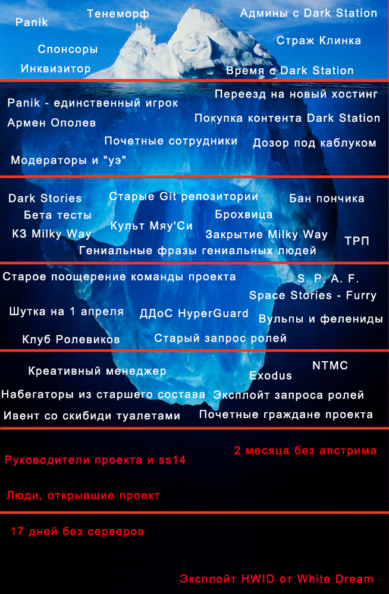
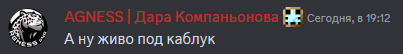
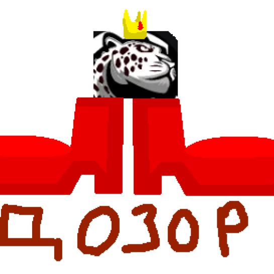
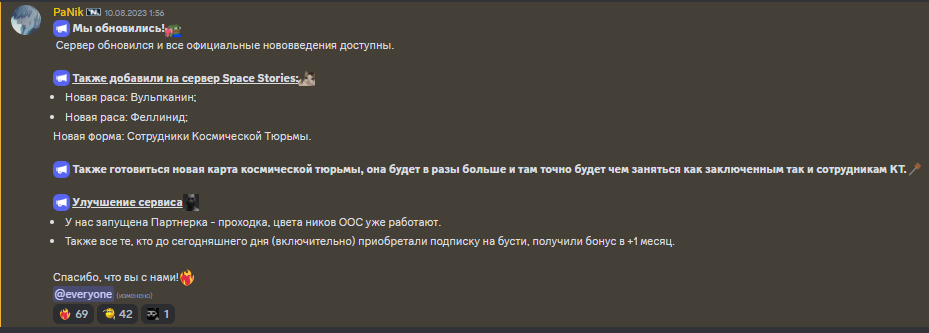

{{#template ../../../templates/outdated.md}}



```admonish danger "Бред"
Информация, представленная на этой странице, написана разными авторами, не синхронизирована с картинкой выше и немного зацензурина.
```

# Поверхность

- Panik - единственный игрок Space Stories

# Мелководье

- Почетные сотрудники

- Переезд на новый хостинг

    05.08.2024 был произведен переезд на новый хостинг.

- Покупка контента Dark Station

    Был куплен данный контент 16.08.2024:
    - Хирургия;
    - Культы (Ратвар, Нар'Си);
    - Понтифик;
    - Вампиры;
    - Улучшенный священник (для борьбы с выше перечисленным);
    - ОЦК;
    - Экономика, зарплаты и т.д. (завязано еще и на ОЦК);
    - Система питомцев для спонсоров;
    - SCP.

- Старые Git репозитории проекта.

    <https://github.com/SpaceStories> - первая организация. Репозиторий ныне не существует. Перестала использоваться 12.10.2023.

    <https://github.com/MetalSage/space-station-14> - второй репозиторий. Перестал использоваться 16.05.2024.

    <https://github.com/Space-Stories/space-station-14> - третий репозиторий. Используется по сей день.

- Шутка на 1 апреля

    Гл. тех. мастер metalsage покинул состав 1 апреля 2024, чтобы позже вернуться и сказать, что это шутка.

# Глубже

- Dark Stories

- Эксплойт запроса ролей

- Бета тесты

- Креативный менеджер

- Закрытие Milky Way

- Модераторы и "уэ"

- Старое поощерение команды проекта

- Старый запрос ролей

- Гениальные фразы гениальных людей

    https://discord.com/channels/1111698541841240164/1136046379446308994

- КЗ Milky Way

- ДДоС HyperGuard

- Армен Ополев

- Бан пончика

- ТРП

    Текстовое РП. Ветка оффтопа.

- Ивент со скибиди туалетами

    Был проведен модератором.

- Культ Мяу'Си

- Брохвица

- NTMC
  
  Созданный BeatusSilva, без разрешения руководства, проект по колониальным морпехам. Ныне не существует. Первый/второй в ру сообществе?

- Набегаторы из старшего состава

    Depresh

- Почетные граждане проекта

    На проекте Space Stories есть специальные роли почетных граждан проекта, которые, как задуманно, выдаются тем, кто сделал большой вклад в проект.

    Около половины человек с этой ролью покинули проект и перешли на другой/имеют плохие отношения с Space Stories.

- Клуб Ролевиков

    Идея была придумана BlackTOKEN'ом, а его развитием занимался Panik.

    Планировался новый набор, но он так и не состоялся.

- Дозор под каблуком

    Во время того, как AGNESS была гл. дозорным весь дозор был пол каблуком. 

    
    

# Очень глубоко

- Exodus

    

    Exodus - проект созданный разработчиками, ушедшими со Space Stories.
    
    Его зарождения связано с внутренними проблемами разработки, политикой руководство проекта Space Stories на момент конца 2023 и начала 2024. До ухода со Space Stories, большой деятель Exodus, Lokilife, проявил желание стать гл. тех. мастером.

    **Были замечены случаи вербовки в ряды Exodus текущей/ушедшой команды проекта Space Stories.**

    Известно, что Lokilife, BeatusCrow, Fragoler, Depresh, Askolot, HedgehogS, BlackTOKEN находятся в составе Exodus и состояли в команде проекта Space Stories.

    wooby, Xam_01, NWatchman когда-то находились в составе Exodus и Space Stories.

    Многие из них, являются почетными гражданами проекта.
# Бездна

- Space Stories - Furry
    
    Файл [furry.toml](https://github.com/Space-Stories/space-station-14/blob/master/Resources/ConfigPresets/Stories/furry.toml). Впервые появился 29 июня 2024.

- Вульпы и фелениды

    

    С 10.08.2023 по 12.10.2023 на сервере были вульпы. 63 дня.

- Руководители проекта и ss14

    Panik очень редко играет.
    Raolin, Oliver не играют.

# На грани человеческого понимания

- 2 месяца без апстрима.

    Начиная с [этого коммита](https://github.com/Space-Stories/space-station-14/commit/32b97ae454e6f5075ecddfdc285526ee80c4a13a) по [этот коммит](https://github.com/Space-Stories/space-station-14/commit/fa88d507ad7fc01086de77bd850a4af61e8bceef).

    C 24 марта по 3 июня. 2024.

    Причиной был уход гл. тех. мастера metalsage, других разработчиков ранее. Остался лишь один doublechest без опыта системного администрирования. Кроме того, из-за ухода состава, ударило никакущие качество кода, поддержка, которого была возможно лишь его авторами.

    Это было критичное происшествие, показавшая проблемы отдела разработки того времени.
    Позже, будут проведены изменения в него, чтобы такое не повторилось вновь.

# За границами человеческого сознания

- Люди, открывшие проект

    **HeadOfEx**
    - Интересная история наказаний: [П4+П3.1](https://discord.com/channels/1111698541841240164/1112658022859284500/1248747658571681832), [п.3.3 п.3](https://discord.com/channels/1111698541841240164/1112658022859284500/1202539740579102740), выговор за метакооп
    - Будучи главным ивентмастером ничего не сделал, как глава.
    - Будучи гл. модератором занимался ивентами.
    - Будучи в отделе мапперов со своим отделом за год намаппил лишь две версии КТ.
    - Будучи пом. администратора никак не изменил ничего.
    - Почетный гражданин проекта.

    **SangorO**

    - Был руководством проекта - ничего не сделал.
    - Был маппером - ничего не сделал.
    - Был ивентмастером - ничего не сделал.
    - Задонатил большие деньги проекту.
    - Почетный гражданин проекта.

    **Oliver**

    - 63 дня был гл. тех. мастера. На этой роли, лишь запустил сервера.
    - Допустил падение серверов на 17 дней.
    - 28.10.2023 стал руководителем проекта. С того момента полный инактив, но роль есть.

- 17 дней без серверов

    Когда Oliver был главным тех. мастером после его технический работ сервер был отключен [12.10.2023](https://discord.com/channels/1111698541841240164/1112654718129414174/1161983965222146208) для подключения защиты от ДДоС атак. Спустя 17 дней, [28.10.2023](https://discord.com/channels/1111698541841240164/1112654718129414174/1167917131715858473) сервера были запущены вновь.

    Известно, что пришлось восстанавливать базу данных и делать откат хостинга. Это было сделано в первые пару дней, но далее возникли другие проблемы. У Oliver'а не получилось починить сборку сервера, поэтому было принято решение сделать перенос на сборку metalsage'a. По итогу, не перенеся некоторый контент сервер был запущен на ней.

    Причинами можно считать, ужасную кооперацию отдела разработки на тот момент, выгорание Oliver'a. Он никак не руководил отделом, списка задач не было, а разработчики делали то, что им вздумается.

    Это было плохое время для Space Stories. Новая сборка теперь зависила от Space Wizards.
    Кто знает, что было бы со Space Stories, если бы сервера остались на прошлой сборке.

    Когда сервера были запущены, metalsage стал новым гл. тех. мастером. Oliver был назначен руководителем проекта, хотя и по сей день руководством не занимается.

    5 августа 2024 года был сменен хостинг сервера. С тех пор, Oliver полностью перестал как либо работать с проектом.
