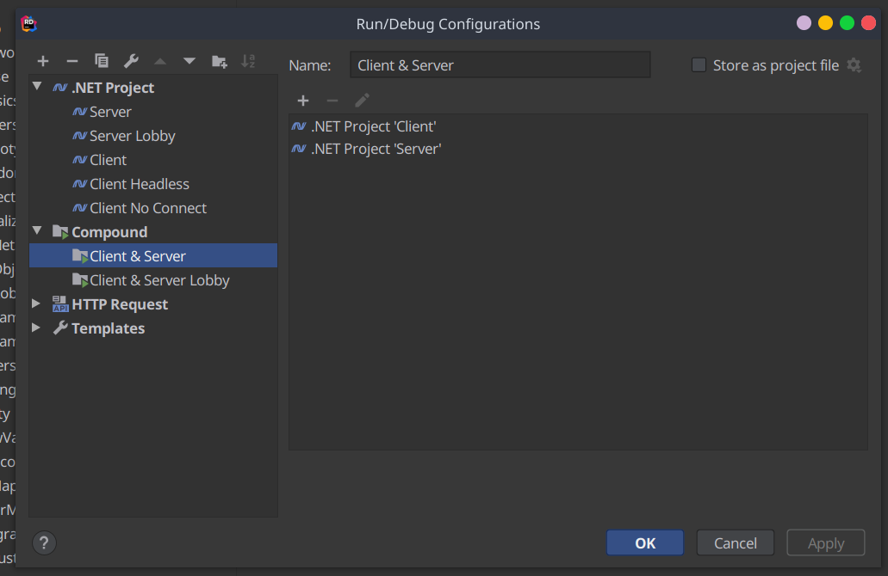
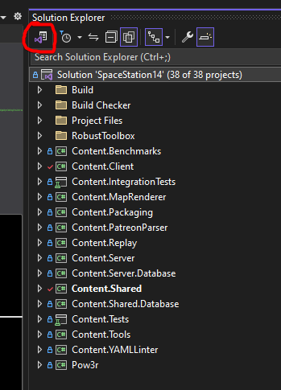
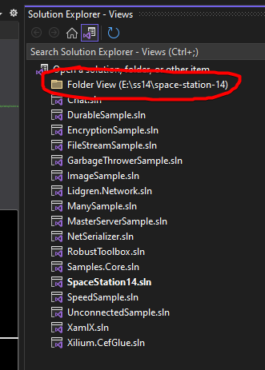
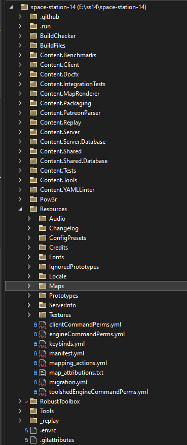
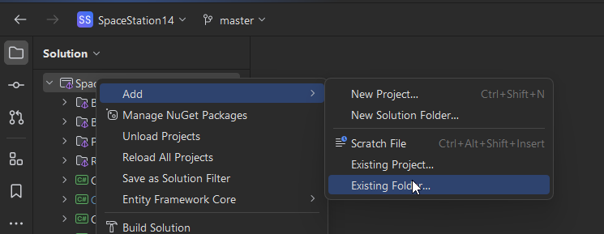
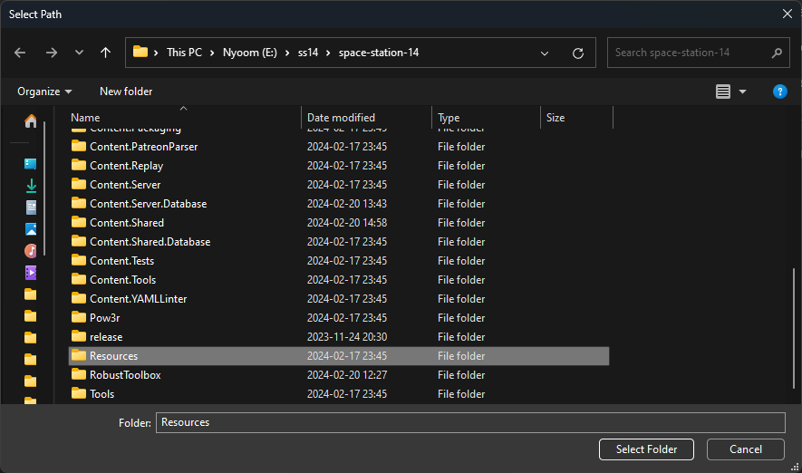
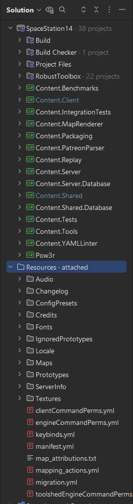

# Настройка среды разработки

Сначала вам понадобится это ПО:

* [Git](https://git-scm.com/) или один из [очень](https://www.sourcetreeapp.com/) [многих](http://www.syntevo.com/smartgit/) [интерфейсов](https://tortoisegit.org/), которые упростят его использование. Обязательно разрешите его установку в вашу PATH [следующим образом](../../assets/images/setup/git-path.png).
* [Python 3.7 или выше](https://www.python.org/). Обязательно установите его на свой [PATH в Windows](../../assets/images/setup/python-path.png). Также убедитесь, что 'py launcher' опция включена при установке в Windows. Вы должны скачать Python из [python.org](https://www.python.org/). Версии, установленные из магазина Windows, иногда вызывают проблемы со сборкой.
* [.NET 8.0 SDK](https://dotnet.microsoft.com/download/dotnet/8.0). Visual Studio также устанавливает это, если вы используете Windows.
  * ARM (M1) Mac пользователям: Нужно обязательно установить x64 .NET, **не** ARM .NET. В настоящее время движок не работает на Mac ARM, поэтому рекомендуется использовать x64 через эмуляцию Rosetta 2.
* Предпочтительно IDE, чтобы разработка не была болезненной (все бесплатные варианты, если не указано иное):
  * Для **Windows**, [Visual Studio 2022 **Community**](https://www.visualstudio.com/). Для минимальной установки (боже, какая она большая) вам понадобится .NET desktop development workload, the C# compiler, C# support, NuGet package manager, MSBuild и .NET 8 SDK или что-то в этом роде.
  * Для **macOS**, [Visual Studio для Mac](https://docs.microsoft.com/en-us/visualstudio/mac/).
  * Для **всех платформ**, (Платный) [Rider](https://www.jetbrains.com/rider/) — одна из лучших доступных IDE, и многие разработчики SS14 предпочитают ее Visual Studio. ~~Студенты колледжей/университетов могут получить бесплатную лицензию на образование, даже если они не специализируются в области компьютерных наук.~~ Не в России.
  * Для **всех платформ**, [Visual Studio Code](https://code.visualstudio.com/) с расширением C#. Обычно среда IDE хуже, чем полноценные IDE, такие как обычная Visual Studio, но некоторым опытным программистам нравится минимализм.
    * **Эксклюзивно для VSCode/VSCodium**: вы можете установить сделанное нашим сообществом [Robust YAML](https://marketplace.visualstudio.com/items?itemName=slava0135.robust-yaml) расширение для лучшего взаимодействия с YAML Robust Toolbox поверх [YAML Language Support](https://marketplace.visualstudio.com/items?itemName=redhat.vscode-yaml) расширения.
  * Для **всех платформ**, [VSCodium](https://vscodium.com/) с расширением C#. С открытым исходным кодом и без раздувания и отслеживания VSCode.

## 1. Клонирование

**Даже если вы уже знакомы с Git, прокрутите вниз, чтобы прочитать раздел о настройке подмодуля. Серьезно.**

Если вы **знакомы с Git**, просто создайте и клонируйте репозиторий, настройте remotes и следуйте приведенному ниже руководству по подмодулям.

Если вы **не знакомы с Git** или просто не знаете, как действовать, следуйте руководству [Git для разработчика SS14](./git-for-the-ss14-developer.md), которое гласит: подробно о том, как внести свой вклад в игру и как настроить исходный репозиторий. Здесь также затрагивается настройка субмодуля, но она также включена сюда из-за ее важности.

## 2. Настройка субмодулей

У нас есть автоматическое средство обновления подмодулей, поэтому вам не придется постоянно беспокоиться о запуске `git submodule update --init --recursive`.

Запустите `RUN_THIS.py` внутри репозитория, скачанного с Python. Желательно из терминала. Это должно занять несколько секунд, поэтому, если он мгновенно остановится, проверьте, используете ли вы Python 3.7+, в противном случае продолжайте читать.

**Если запуск `RUN_THIS.py` сразу открывает и закрывает окно: не волнуйтесь.** Это не означает, что все не удалось. Сценарий автоматически закрывается после завершения, поэтому, если вы хотите убедиться, что он работает правильно, проверьте подмодуль `/RobustToolbox/` и убедитесь, что все файлы находятся там. Если нет, попробуйте прочитать устранение неполадок внизу этой страницы.

Примечание. Если при запуске у вас возникли проблемы с отсутствующими файлами, рекомендуется один раз запустить `git submodule update --init --recursive` вручную на случай, если с Python что-то пойдет не так.

Однако, если вы *действительно* хотите изменить движок напрямую или обновить подмодуль вручную (автоматическое обновление может быть затруднительным), создайте файл с именем `DISABLE_SUBMODULE_AUTOUPDATE` внутри каталога `BuildChecker/`.

И теперь ваш репозиторий настроен правильно!

## 3. Установка IDE

### Visual Studio

1. Загрузите Visual Studio Community (если у вас нет платной версии) [отсюда](https://visualstudio.microsoft.com/vs/community/).
2. Запустите установщик и выберите `.net desktop development`, затем установите.
3. Если установщик запросит среду разработки, выберите Visual C#.
4. Откройте Visual Studio
5. Выберите `Open a project or solution`, затем перейдите к клонированному репозиторию и откройте `SpaceStation14.sln`.

### JetBrains Rider
1. Установите Rider, мы предлагаем использовать [Jetbrains Toolbox](https://www.jetbrains.com/toolbox-app/), поэтому он также может автоматически обновляться в будущем.
2. Пройдите настройку установки.
3. Нажимаем "Open" и выбираем `SpaceStation14.sln`
4. Если вы планируете заниматься разработкой движка, вам необходимо добавить Robust Toolbox в сопоставления каталогов, чтобы Riders VCS могла обнаруживать изменения в Robust.
    Откройте настройки Riders, перейдите в раздел "Version Control" > "Directory Mappings" и нажмите кнопку "plus" (+). В качестве каталога укажите папку RobustToolbox в проекте и Git в качестве системы контроля версий.

### VSCodium
1. Загрузите [VSCodium здесь](https://vscodium.com/) или напрямую [на Github здесь](https://github.com/VSCodium/vscodium/releases) (откройте в последнем релизе раскрывающийся список ресурсов, затем перейдите к ZIP-файлу или .exe для вашей ОС).
2. Запустите установщик или распакуйте zip-файл в выбранное вами место и запустите .exe после извлечения.
3. После установки перейдите на вкладку "Extensions" (в верхнем левом углу, выглядит как 4 плитки) и найдите C#. Расширение от "Muhammad-Sammy" с более чем 70 тысячами загрузок и зелено-белым логотипом — это то самое, установите его. Идентификатор расширения `muhammad-sammy.csharp`.
4. Выберите файл > открыть папку, затем перейдите к клонированному репозиторию сверху и откройте его папку.
5. Когда будет предложено открыть решение, выберите "SpaceStation14.sln" или установите для параметра dotnet.defaultSolution значение SpaceStation14.sln в настройках рабочей области.
6. Теперь вы можете запускать и отлаживать свою игру. Выберите значок над "Extensions" с названием «Run and Debug», а в раскрывающемся списке рядом с зеленой кнопкой воспроизведения вы можете выбрать Server/Client. Это запустит и клиент, и сервер, открыв игру для отладки. Соответствующая информация появится в отладке внизу. Выберите процессы в стеке вызовов слева, чтобы изменить то, что вы отлаживаете.

## 4. Работа с SS14

Теперь можно переходить к компиляции клиента и сервера! Используйте свой вариант IDE, чтобы открыть файл решения SpaceStation14.sln и нажать кнопку сборки.

Чтобы скомпилировать без IDE, запустите dotnet build в каталоге репозитория Space Station 14. Затем вызовите следующие команды для запуска клиента и сервера.
* `dotnet run --project Content.Server`
* `dotnet run --project Content.Client`

Обе эти команды по умолчанию используют конфигурацию Debug. Чтобы включить Release, добавьте `--configuration Release` к dotnet run.
 
Примечание. Если у вас возникли проблемы с тем, что dotnet не находит libssl (например, при использовании libressl), попробуйте установить для переменной среды CLR_OPENSSL_VERSION_OVERRIDE соответствующую версию. Например, установите для него значение "48", если ваш "/usr/lib" содержит "libssl.so.48".
Если это не сработает, вы также можете попробовать вместо этого запустить `ln -s /usr/lib/libssl.so /usr/local/lib/libssl.so.1.0.0`.

## 5. Настройка параметров сборки

Клиент и сервер SS14 — это независимые проекты, но оба можно запустить с помощью одной кнопки где-нибудь в вашей IDE. Однако это необходимо настроить. Примечание. **При разработке из IDE рекомендуется запускать Content.Client и Content.Server.** *Не* Robust.Client или Robust.Server. Причина в том, что запуск `Content.*` позволит вашей IDE правильно узнать о зависимостях и обеспечить правильную перестройку всего. Если вы запускаете Robust.Client напрямую, вам придется каждый раз проверять, что решение полностью построено, что раздражает и о нем легко забыть. Если вы не уверены, что такое Robust или Content, ознакомьтесь с [этой страницей](../codebase-info/codebase-organization.md), чтобы узнать, как организован проект.

### Visual Studio 2022

В Visual Studio 2022 вы можете настроить кнопку сборки для запуска как сервера, так и клиента, щелкнув решение правой кнопкой мыши и выбрав `Configure StartUp Projects...`. Когда появится всплывающее меню, выберите `Multiple startup projects:` и установите для действия `Content.Client` и `Content.Server` значение `Start`. После того, как вы примените изменения, нажмите большую кнопку `Start` с зеленой стрелкой рядом с ней, чтобы одновременно запустить клиент и сервер.

Примечание. Если у вас возникли проблемы с неправильной сборкой программы, возможно, вам придется настроить сборку всегда перед запуском. Перейдите в раздел `Projects and Solutions/Build and Run` и измените параметр `On Run, when projects are out of date` на `Always build`.

В VS вы также можете использовать клавиши F7 для сборки проекта и F5 для его запуска.

### Visual Studio Code

Расширение C# предоставляет `"coreclr"` тип запуска, который можно использовать для запуска `Content.Server` и `Content.Client` исполняемые файлы в соответствующих `bin/` папок. [Compound launch configuration](https://code.visualstudio.com/Docs/editor/debugging#_compound-launch-configurations) может использоваться для одновременного запуска сервера и клиента.

### Командная строка

Забилдите с  `dotnet build` и запустите клиент и сервер в разных командных строках с помощью:

* `dotnet run --project Content.Server`
* `dotnet run --project Content.Client`

Также определенно есть способ запустить две команды одновременно, но вам, вероятно, стоит погуглить.

### JetBrains Rider

В Rider вы можете создать составную конфигурацию для одновременного запуска или отладки клиента и сервера. Довольно удобно!



## 6. Настройка каталогов IDE

IDE C#, такие как Visual Studio и Rider, не отображают автоматически папку Resources в проекте. Эта папка содержит все файлы, не относящиеся к C#, такие как спрайты, аудио и, самое главное, прототипы YAML. В этих инструкциях объясняется, как сделать так, чтобы эта папка отображалась в вашей IDE, чтобы вы могли легко с ней работать.

### Visual Studio 2022

В Visual Studio вы можете переключить **Solution Explorer** с представления "solution" (отображение только проектов C#) на "folder" (отображение всех файлов в проекте). Нажмите кнопку для переключения представлений следующим образом, затем выберите вид папки:




После этого обозреватель решений должен выглядеть примерно так, и вы сможете легко получить доступ к папке `Resources`:



### JetBrains Rider

В Rider вы можете "присоединить" каталог ресурсов к проекту. Сделайте это, щелкнув правой кнопкой мыши в проводнике IDE, а затем выполнив "Add" -> "Existing Folder...". Выберите каталог "Resources" в средстве выбора файлов.




После этого обозреватель решений должен выглядеть примерно так, и вы сможете легко получить доступ к папке `Resources`:



### Visual Studio Code

Visual Studio Code по умолчанию отображает все файлы, поэтому дополнительная настройка здесь не требуется.

<!-- # Reproducible Development Environment with Nix/NixOS

An easier way to set up your development environment for Linux users is to leverage Nix. Nix is a package manager and a functional domain specific language that allows one to declare anything from development environments to entire systems. In order to prevent the dreaded "it works on my machine" conundrum, we can declare a development environment in Nix that spawns an isolated reproducible shell.

## Setting up Nix/NixOS with flakes

You can [install Nix](https://nixos.org/download) either through installing the NixOS distribution itself or by using the script that is compatible with all Linux distributions that use systemd (Ubuntu, Fedora, Mint etc). For the sake of simplicity and convenience, it is recommended that you install Nix in a distribution that you are comfortable with instead of making the jump to a different operating system entirely. It is also possible to use Nix with MacOS through `nix-darwin` though this has not been tested as of yet and thus not covered in this article.

Once Nix is installed, you should enable experimental features such as flakes. If you are on a non-NixOS distribution, you can just add the following to your `~/.config/nix/nix.conf`.

* `experimental-features = nix-command flakes`

If you're using NixOS, you only need to add these options to your `configuration.nix` file.

* `nix.settings.experimental-features = [ "nix-command" "flakes" ];`

For more information about how to enable Nix flakes, see [here](https://nixos.wiki/wiki/Flakes).

## Using Nix flakes for a Robust Development Environment

NB it is technically required that you already have Git installed but in the case with most Linux distributions it comes preinstalled. In the highly unlikely case that you do not:

* Use your distribution's package manager

* Declare it in your `configuration.nix` file if you're using NixOS. It's recommended that you check the [appropriate section in the NixOS manual](https://nixos.org/manual/nixos/stable/#sec-configuration-file) but in short you should add `pkgs.git` into the `environment.systemPackages` attribute.

Using your terminal you can simply navigate to the root directory of your SS14 repo and run:

* `nix develop`

Nix will automatically handle all dependencies as declared by `shell.nix` and called by the `flake.nix` file. You will have a new ephemeral shell (known as a `devShell`) that has everything that you need installed to build SS14 from source.

This remains the reason as to why flakes are highly recommended despite being considered an experimental feature. We can make sure that everyone has the same versions of dependencies by specifying the nixpkgs collection version in the input attribute of the flake and locking the versions in a `flake.lock` file. In this way, all contributors that use Nix/NixOS get to have the exact same development environment. No pun intended, but that is pretty robust!

## (Optional) Run JetBrains Rider through Nix

You can then use either use an editor or IDE of your choosing. However within the shell that you already spawned you can just specify that you require JetBrains Rider. Run this command in your devShell.

* `NIXPKGS_ALLOW_UNFREE=1 nix shell nixpkgs#jetbrains.rider --impure`

From your new shell you can start a "detached" JetBrains Rider process by running something like:

* `nohup rider >/dev/null 2>&1 &`

And voila! You have robustly set up your development environment in a way that doesn't result in pesky buildup of "state". You can practically work on SS14 from any Linux distribution (granted that they use systemd) without irreversibly changing your system. -->

# Поиск проблем

Убедитесь, что [первые три элемента](#setting-up-a-development-environment) сверху загружены.

## `RUN_THIS.py` не запускается
Убедитесь, что Python установлен с веб-сайта, а не из Microsoft Store. Если он установлен из Microsoft Store, удалите его, а затем загрузите и установите с веб-сайта Python.

Если вы используете Windows и были перенаправлены в Microsoft Store или на вашем терминале появилось сообщение о том, что Python не установлен. Эта проблема может быть вызвана глупым ярлыком Microsoft. Что вы можете отключить, выполнив поиск по запросу `Manage App Execution Aliases` и отключив две ссылки на Python.

### py не найден
Если Python был установлен с веб-сайта и команда `python` работает, но вы по-прежнему получаете сообщение об ошибке "py не установлен", проверьте, работает ли `C:\WINDOWS\py.exe`. Если да, то добавьте в свой PATH `C:\WINDOWS`.

## System.DllNotFoundException: Unable to load DLL 'freetype6' or one of its dependencies: The specified module could not be found.

```PS C:\Users\Larme\Downloads\space-station-14> dotnet run --project Content.Client
Unhandled exception. Robust.Shared.IoC.Exceptions.ImplementationConstructorException: Robust.Client.Graphics.FontManager threw an exception inside its constructor.
 ---> System.DllNotFoundException: Unable to load DLL 'freetype6' or one of its dependencies: The specified module could not be found. (0x8007007E)
   at SharpFont.FT.FT_Init_FreeType(IntPtr& alibrary)
   at SharpFont.Library..ctor()
   at Robust.Client.Graphics.FontManager..ctor(IClyde clyde) in C:\Users\Larme\Downloads\space-station-14\RobustToolbox\Robust.Client\Graphics\FontManager.cs:line 33
   --- End of inner exception stack trace ---
   at Robust.Shared.IoC.DependencyCollection.BuildGraph() in C:\Users\Larme\Downloads\space-station-14\RobustToolbox\Robust.Shared\IoC\DependencyCollection.cs:line 348
   at Robust.Shared.IoC.IoCManager.BuildGraph() in C:\Users\Larme\Downloads\space-station-14\RobustToolbox\Robust.Shared\IoC\IoCManager.cs:line 271
   at Robust.Client.GameController.InitIoC(DisplayMode mode) in C:\Users\Larme\Downloads\space-station-14\RobustToolbox\Robust.Client\GameController\GameController.IoC.cs:line 16
   at Robust.Client.GameController.ParsedMain(CommandLineArgs args, Boolean contentStart, IMainArgs loaderArgs, GameControllerOptions options) in C:\Users\Larme\Downloads\space-station-14\RobustToolbox\Robust.Client\GameController\GameController.Standalone.cs:line 49
```

Удалите .NET Core SDK x86. Скачайте .NET Core SDK x64.


## Клиент и сервер недоступны в Visual Studio для настройки в нескольких запускаемых проектах.

Возможно, это связано с тем, что вы открыли проект как папку, а не как решение. Обязательно откройте его как решение и щелкните файл `SpaceStation14.sln`.

## Система не может найти указанный файл RUN_THIS.py.

`Система не может найти указанный файл` ошибка обычно означает, что OneDrive конфликтует с репозиторием git. Клонируйте репозиторий git за пределами OneDrive или отключите синхронизацию клонированной папки.
